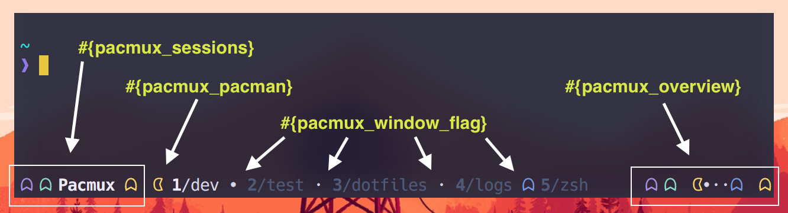

# Pacmux

Enables new format strings to allow your Tmux status line to look like `Pᗣᗧ·•·MᗣN`
 

## Installation
### Installation with Tmux Plugin Manager (recommended)

Add plugin to the list of TPM plugins in .tmux.conf:

    set -g @plugin 'eduarbo/pacmux'

Hit `prefix + I` to fetch the plugin and source it.  You should now be able to
use the new format strings.

## Manual Installation

Clone the repo:

    $ git clone https://github.com/eduarbo/pacmux ~/clone/path

Add this line to the bottom of `.tmux.conf`:

    run-shell ~/clone/path/pacmux.tmux

Reload TMUX environment:

    # type this in terminal
    $ tmux source-file ~/.tmux.conf

Now, you should be able to use the new format strings.

## Usage

This plugin enables 4 new format strings to give your status line a `Pᗣᗧ·•·MᗣN` look.
All of them are available for the Tmux options `status-left`, `status-right`,
`window-status-format` and `window-status-current-format`.

`#{pacmux_window_flag}` is meant to be used in the `window-status-format` tmux option
to represent the window flag with a symbol.

### Destructuring symbols
- `ᗧ` Pac-man represents the active window
- `·` Pac-Dot represents a quiet window
- `•` Power Pellet represents a window with activity
- `ᗣ` Blue Ghost represents a window with bell

`#{pacmux_sessions}` and `#{pacmux_overview}` are meant to be used either in
`status-left` or `status-right` tmux option.

`#{pacmux_sessions}` will represent each attached session as Blinky, Pinky, Inky
or Clyde. The ghost representing the current session will be followed by the
session name.

`#{pacmux_overview}` will give you and overview of the attached sessions and
session windows in a `Pᗣᗧ·•·MᗣN` style.

`#{pacmux_pacman}` just prints the Pac-Man-like character `ᗧ` in yellow. Useful
for `window-status-format` tmux option.

## Changing defaults

By default these styles are used:

- Pac-Man: `fg=yellow`
- Blinky: `fg=red`
- Pinky: `fg=brightmagenta`
- Inky: `fg=brightcyan`
- Clyde: `fg=yellow`
- Blue Ghost: `fg=blue`
- Dots `fg=white`

Note that these colors depend on your terminal / X11 config.

You can change these defaults by adding the following user variables to
`tmux.conf`. Use the tmux style format (See the `message-command-style` option).

    set -g @pacmux-blinky-style "fg=#fc0d1b"
    set -g @pacmux-pinky-style "fg=#febafe"
    set -g @pacmux-inky-style "fg=#2dfffe"
    set -g @pacmux-clyde-style "fg=#feb75b"

    set -g @pacmux-blue-ghost-style "fg=#2533fb"
    set -g @pacmux-pacman-style "fg=#ffff00"
    set -g @pacmux-dots-style "fg=#ffb897"

Don't forget to reload tmux environment `($ tmux source-file ~/.tmux.conf)` after
you do this.
 

## License

[MIT](LICENSE.md)
