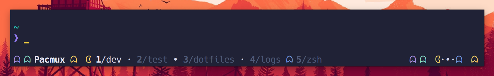
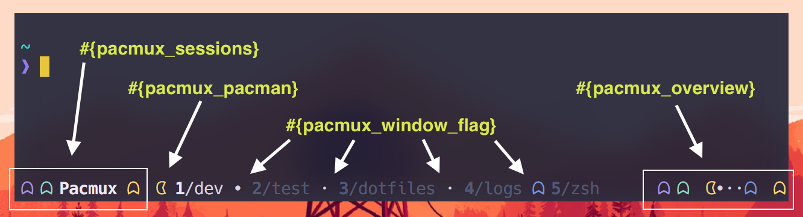

# Pacmux

[](LICENSE.md)
[](https://github.com/eduarbo/pacmux/actions/workflows/lint.yml)

A tmux plugin that transforms your status line into a `Pᗣᗧ·•·MᗣN` arcade.



## Features

- **6 format strings** for fully customizable Pac-Man-themed status lines
- **Session indicators** — each session rendered as Blinky, Pinky, Inky, or Clyde
- **Window state mapping** — active (Pac-Man), quiet (dot), activity (pellet), bell (blue ghost)
- **Power pellet mode** — ghosts turn blue when a window is zoomed
- **Mouth animation** — Pac-Man alternates between open and closed mouth on each refresh
- **Character customization** — swap any glyph (Nerd Font icons, emoji, etc.)
- **Full color control** — override every color via tmux options

## Requirements

- tmux >= 1.9
- bash >= 4.0

## Installation

### With [TPM](https://github.com/tmux-plugins/tpm) (recommended)

Add to your `tmux.conf`:

```tmux
set -g @plugin 'eduarbo/pacmux'
```

Press `prefix + I` to install.

### Manual

```bash
git clone https://github.com/eduarbo/pacmux ~/.tmux/plugins/pacmux
```

Add to the bottom of `tmux.conf`:

```tmux
run-shell ~/.tmux/plugins/pacmux/pacmux.tmux
```

Reload with `tmux source-file ~/.tmux.conf`.

## Format Strings

| Format String | Description | Recommended Option |
|---|---|---|
| `#{pacmux_overview}` | All sessions + windows of the active session in Pac-Man style | `status-right` |
| `#{pacmux_sessions}` | Each session as a colored ghost, active session shows its name | `status-left` |
| `#{pacmux_window_flag}` | Window state as a Pac-Man symbol (dot, pellet, or blue ghost) | `window-status-format` |
| `#{pacmux_window_flag_zoomed}` | Like `window_flag` but ghosts turn blue when window is zoomed | `window-status-format` |
| `#{pacmux_pacman}` | The Pac-Man character `ᗧ` in yellow (animated if enabled) | `window-status-current-format` |
| `#{pacmux_ghost}` | A ghost with cycling color based on window index | `window-status-format` |

### Symbol Mapping



| Symbol | Meaning |
|---|---|
| `ᗧ` | Pac-Man — active window |
| `·` | Pac-Dot — quiet window |
| `•` | Power Pellet — window with activity |
| `ᗣ` | Blue Ghost — window with bell |

## Example Configuration

```tmux
# Status left: zoom icon + session ghosts
set -g status-left-style fg=brightwhite,bold
set -g status-left '#{?window_zoomed_flag, ,}#{pacmux_sessions} '

# Status right: full overview
set -g status-right '#{pacmux_overview}'

# Window tabs
set -g window-status-separator ' '
set -g window-status-style fg=brightblack,bold,bg=black
set -g window-status-last-style default
set -g window-status-activity-style default
set -g window-status-bell-style default
set -g window-status-format '#{pacmux_window_flag} #I#[none,fg=brightblack]/#W'

# Active window tab
set -g window-status-current-style fg=white,bold,bg=black
set -g window-status-current-format '#{pacmux_pacman} #I#[none,fg=white]/#W'
```

## Options Reference

### Style Options

Control the colors of each element using tmux style format (see `message-command-style` in the tmux man page).

| Option | Default | Description |
|---|---|---|
| `@pacmux-pacman-style` | `fg=yellow` | Pac-Man color |
| `@pacmux-blinky-style` | `fg=red` | Blinky (1st ghost) color |
| `@pacmux-pinky-style` | `fg=brightmagenta` | Pinky (2nd ghost) color |
| `@pacmux-inky-style` | `fg=brightcyan` | Inky (3rd ghost) color |
| `@pacmux-clyde-style` | `fg=yellow` | Clyde (4th ghost) color |
| `@pacmux-blue-ghost-style` | `fg=blue` | Vulnerable ghost color |
| `@pacmux-dots-style` | `fg=white` | Dots and pellets color |

### Character Options

Override the default Unicode characters. Useful for Nerd Font or emoji substitution.

| Option | Default | Description |
|---|---|---|
| `@pacmux-pacman-char` | `ᗧ` | Pac-Man (open mouth) |
| `@pacmux-pacman-close-char` | `ᗤ` | Pac-Man (closed mouth, for animation) |
| `@pacmux-ghost-char` | `ᗣ` | Ghost |
| `@pacmux-dot-char` | `·` | Pac-Dot (quiet window) |
| `@pacmux-pellet-char` | `•` | Power Pellet (activity window) |

### Behavior Options

| Option | Default | Description |
|---|---|---|
| `@pacmux-animate` | `off` | Set to `on` to animate Pac-Man's mouth on each status refresh |
| `@pacmux-separator` | ` ` (space) | Character between elements in overview and sessions |

### Example: Custom Colors

```tmux
set -g @pacmux-blinky-style "fg=#fc0d1b"
set -g @pacmux-pinky-style "fg=#febafe"
set -g @pacmux-inky-style "fg=#2dfffe"
set -g @pacmux-clyde-style "fg=#feb75b"
set -g @pacmux-blue-ghost-style "fg=#2533fb"
set -g @pacmux-pacman-style "fg=#ffff00"
set -g @pacmux-dots-style "fg=#ffb897"
```

### Example: Nerd Font Icons

```tmux
set -g @pacmux-pacman-char ""
set -g @pacmux-ghost-char "󰊠"
```

### Example: Enable Animation

```tmux
set -g @pacmux-animate on
```

## What's New in v2

- **Bug fix:** Ghost color rotation now correctly starts with Blinky for the first session
- **Bug fix:** Session names now display properly in `#{pacmux_sessions}`
- **New:** `#{pacmux_ghost}` format string for per-window colored ghosts
- **New:** `#{pacmux_window_flag_zoomed}` — power pellet mode (blue ghosts when zoomed)
- **New:** Pac-Man mouth animation (`@pacmux-animate`)
- **New:** Character customization (`@pacmux-*-char` options)
- **New:** Configurable separator (`@pacmux-separator`)
- **Improved:** Full ShellCheck compliance and CI via GitHub Actions
- **Improved:** Proper variable quoting and error handling throughout

## Recording a Demo

To record an animated GIF for your own config, you can use [vhs](https://github.com/charmbracelet/vhs):

```bash
vhs record pacmux-demo.tape
```

Or use [asciinema](https://asciinema.org/) and convert with [agg](https://github.com/asciinema/agg):

```bash
asciinema rec pacmux-demo.cast
agg pacmux-demo.cast pacmux-demo.gif
```

## Contributing

1. Fork the repo
2. Create your branch (`git checkout -b my-feature`)
3. Ensure `shellcheck pacmux.tmux scripts/*.sh` passes
4. Commit and open a PR

## License

[MIT](LICENSE.md) - Eduardo Ruiz Macias
